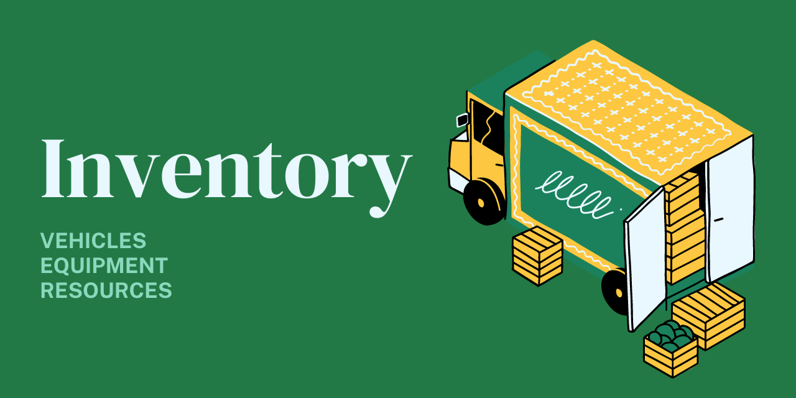

# Inventory 📦

> An inventory service for managing farming vehicles, equipment, and resources. Built in Typescript with [NestJS](https://nestjs.com/), [Prisma](https://www.prisma.io/), and [Sveltekit](https://kit.svelte.dev/)



## What is this?

1. REST API for managing farm inventory via HTTP requests
2. Web application for managing farming inventory

The inventory service enables users to keep track of farm inventory across multiple IoT devices, servers, applications, or databases. This service provides a foundational interface for inventory management and interaction.

## Quickstart ⚡

You can either build the project from source, or deploy it via docker.

### Docker Compose

```shell
# Start the database and API via docker-compose
docker-compose up -d

# View the UI
http://localhost:3000

# View the API docs
http://localhost:5000/api/docs
```

## Run the app locally

```bash
# development
$ npm run start

# watch mode
$ npm run start:dev

# production mode
$ npm run start:prod
```

## Database migrations

Inventory comes with [Prisma](https://www.prisma.io/) built-in. Prisma is used as the primary ORM and database migrations management service.

```bash
# run the migrations
npm run migrate

# run prisma studio
npm run prisma:studio

# generate typescript client for prisma schema
npm run prisma:generate
```

## Test

```bash
# unit tests
$ npm run test

# e2e tests
$ npm run test:e2e

# test coverage
$ npm run test:cov
```
